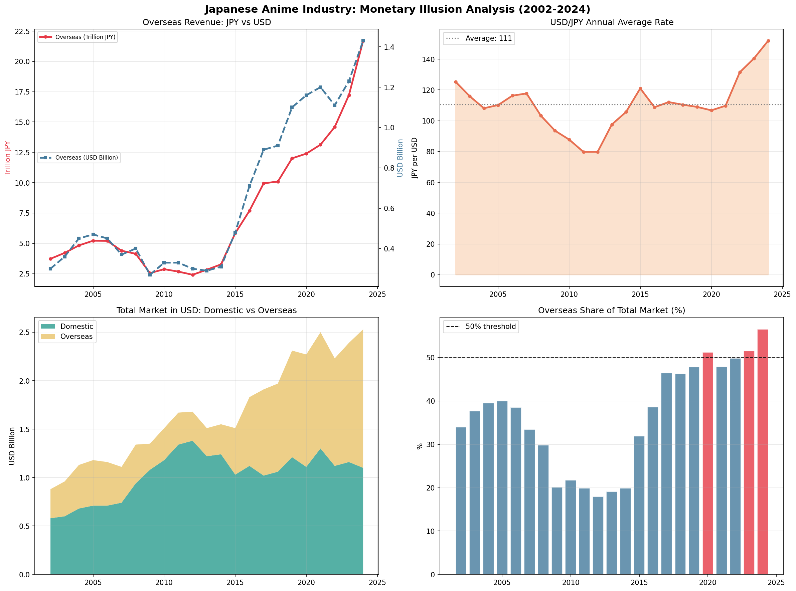

# Japanese Anime Industry: Monetary Illusion Analysis (2002–2024)

> *How much of anime's international revenue boom is real growth — and how much is yen depreciation?*



---

## Key Insights

**The monetary illusion**: Japan's anime overseas revenues surged **+49% in JPY terms** between 2022 and 2024. Corrected for USD/JPY exchange rates, the same period shows **+29% in USD terms**. The ~20 percentage point gap is driven by the yen's historic depreciation — not accelerating global demand. Studios, investors, and policymakers relying on yen-denominated figures are systematically overstating the pace of international growth.

**The domestic reality**: Converting domestic revenues into USD reveals a market in structural contraction. The shift from high-margin physical media (Blu-ray box sets at ¥40,000/season) to low-ARPU fragmented streaming subscriptions (¥550/month) has hollowed out domestic monetization even as consumption volume held steady. Exporting is no longer just a growth strategy — it is a survival mechanism for an industry facing demographic headwinds at home.

📖 Full economic analysis on Medium: [Japan's Anime Industry: Separating Real Growth from Monetary Illusion](https://medium.com/@imdata5451/japans-anime-industry-separating-real-growth-from-monetary-illusion-b8b0fc23db4b)

---

## Visualizations

Four panels tell the story:

| Panel | What it shows |
|-------|--------------|
| Overseas Revenue: JPY vs USD | The divergence opening post-2022 — the illusion made visible |
| USD/JPY Annual Average | The mechanism: yen at historic lows since 2022 |
| Total Market in USD | Real scale: steady growth, not explosion |
| Overseas Share (%) | The 50% crossover — real but timing inflated by currency |

---

## Data Sources

| Source | Coverage | Access |
|--------|----------|--------|
| AJA Anime Industry Report 2025 (Summary) | 2002–2024, domestic & overseas revenues | Public PDF |
| USD/JPY historical annual averages | 2002–2024 | Public / macrotrends |

---

## Methodology

1. Extract domestic and overseas revenue series from AJA public reports (¥100M units)
2. Compute annual USD/JPY averages (calendar year)
3. Convert overseas revenues to USD billions: `overseas_usd = overseas_jpy / usd_jpy / 100`
4. Compare JPY and USD growth trajectories to isolate monetary vs. volumetric components

---

## Repository Structure

```
japan-market-analysis/
│
├── data/
│   ├── aja_fx_combined.csv      # Main dataset: AJA revenues + forex
│   └── usdjpy_fiscal.csv        # USD/JPY by Japanese fiscal year (FY2013–FY2024)
│
├── fx_download.py               # USD/JPY data retrieval (yfinance)
├── visualizations.py            # All 4 charts
│
├── anime_market_analysis.png    # Output dashboard
└── README.md
```

---

## How to Run

```bash
# Install dependencies
pip install pandas matplotlib yfinance

# Generate visualizations
python visualizations.py
```

> **Note**: yfinance SSL issues on Windows may require setting `os.environ['CURL_CA_BUNDLE'] = ''` before import. See `fx_download.py` for the workaround used.

---

## Limitations

- USD/JPY used as proxy for all foreign currency exposure (EUR, CNY, KRW not modeled)
- AJA figures are survey-based estimates, not audited financials
- Directional findings are robust; precise numbers are indicative

---

## Further Work

A natural extension applies the same methodology at the company level. **Toei Animation (4816.T)** is the ideal candidate: a pure-play studio with clean segment reporting separating domestic licensing from overseas licensing by franchise (Dragon Ball, One Piece, Digimon). This would allow isolating monetary vs. volumetric effects at the firm level — *work in progress*.
